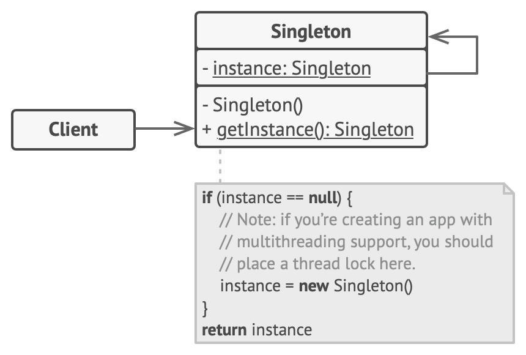

# Singleton Pattern

Singleton Pattern is a creational design pattern that ensures one creation a class. The class will have only one instance, than a function inside of it will provide this instance.

