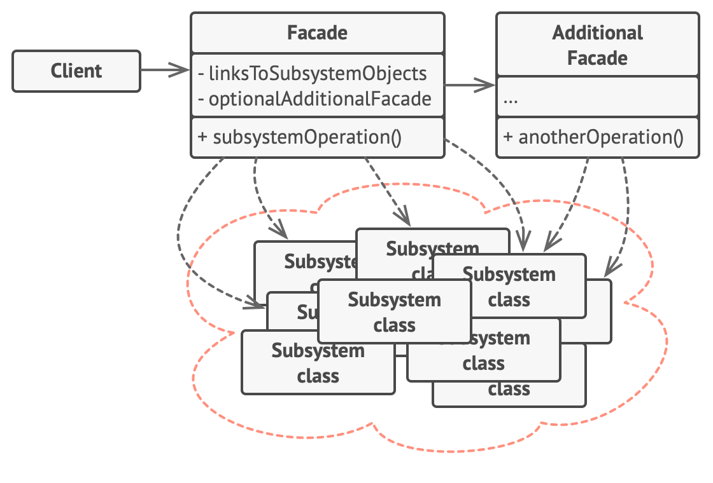

# Facade Pattern

Facade pattern is a structural design pattern that provides a simplified interface to a library, a framework, or any complex set of classes.

## Benefits of Facade Pattern

The Facade Class works as an Interface that the client interacts with, it hides the complexity of the systems providing only a simplified Interface.
